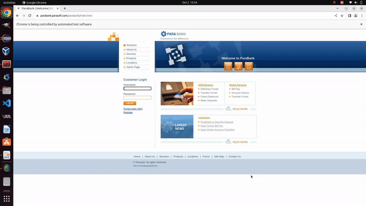

<!-- PROJECT HEADER -->
<p align="center">
  <!--PROJECT TITLE AND DESCRIPTION -->
 <h1 align="center">Parabank Online Web Application (Using Selenium & Data-Driven with Cucumber)</h1> 

  <p align="center">
    A web automation project to automate testing process of Para Bank Web Application built using Selenium, TestNG and Cucumber in Java.
    <br /><br/>
    <a href="https://www.linkedin.com/in/lavatech-technology-81aa6a14b/">
        </a>
    <a href="">
        </a>
  </p>
</p>
<hr>

<!-- ABOUT THE PROJECT -->

## About The Project
In this automation exercise, you'll automate core functionalities of the [Parabank online banking application](https://parabank.parasoft.com/parabank/index.htm) using Selenium, TestNG, and Cucumber with Data-Driven Testing. The key test scenarios include:

* Register a New Account: Automate the user registration process by filling out dynamic data (like name, address, and credentials) using data-driven testing from Cucumber's Scenario Outline. This allows testing registration with multiple sets of user data.
* Log in to the Application: Log in with different sets of credentials to validate both successful and unsuccessful login attempts. Use data-driven testing to verify login functionality for multiple users.
* Create a New Savings Account: Once logged in, automate the creation of a savings account.
* Transfer Amount Between Accounts: Automate the process of transferring funds between accounts.



### Built With
* [Java 8](https://www.oracle.com/java/technologies/javase/javase-jdk8-downloads.html) as programming language
* [Maven](https://maven.apache.org/) for Package Management and Build Automation
* [Selenium](https://www.selenium.dev/) for Web Automation
* [TestNG](https://testng.org/) for Java testing framework that supports annotations, parallel execution, and detailed reporting for efficient test automation.
* [Cucumber](https://cucumber.io/docs/cucumber/) for writing BDD-style tests in Gherkin syntax.

<!-- GETTING STARTED -->
## Getting Started

### Prerequisites
  Basic understanding of Java with Maven, Selenium, TestNG and Cucumber.

### Running the project
Steps are listed below to get this project up and running in your development environment.

* Setup Java with JDK 1.8. For reference: Use this official [Tutorial](https://docs.oracle.com/javase/10/install/installation-jdk-and-jre-microsoft-windows-platforms.htm)

* Setup Maven. Follow this link: [Maven Setup](https://maven.apache.org/install.html)

* Clone this repository in your target folder.
```
git clone https://github.com/lavatech321/ParaBank_selenium_automation.git
```

* Open _parabank.testautomation_ folder in Eclipse by selecting "File -> Import -> Maven -> Existing Maven Project" and select _parabank.testautomation_ folder. 
  
Optionally, run maven build command if you don't see "Maven Dependencies" folder:

```
mvn clean install
```

You can also right click the project, and select "Maven -> Update Project -> Check the 'Force Update of Snapshots/Releases' -> Ok". This will update the "Maven Dependencies" project.
  
* Execute the project using below maven command:

```
mvn clean test
```

* Optionally, after making any changes to the repository, you can package the code into a jar file:
  
```
mvn clean package
```
  
_Note: I have used JAR for packaging. If you want to build into the jar file, change the `<packaging>` inside pom.xml file to war._

```
 <packaging>jar</packaging>
```

Congrats !!! You are now able to run the project in your own development environment.

* You can run this project as _TestNG Suite_ by right clicking the project and select "Run As -> TestNG Suite".

_Note: I have place *testng.xml* file under src/test/resources folder._

## Authors

* **Lavatech Technology** - *Initial work* - [Yogita Soni](https://github.com/lavatech321)

## Contact
[![LinkedIn][linkedin-shield]][linkedin-url]

<!-- MARKDOWN LINKS & IMAGES -->
<!-- https://www.markdownguide.org/basic-syntax/#reference-style-links -->
[linkedin-shield]: https://img.shields.io/badge/-LinkedIn-black.svg?style=for-the-badge&logo=linkedin&colorB=555
[linkedin-url]: https://www.linkedin.com/in/lavatech-technology-81aa6a14b/
